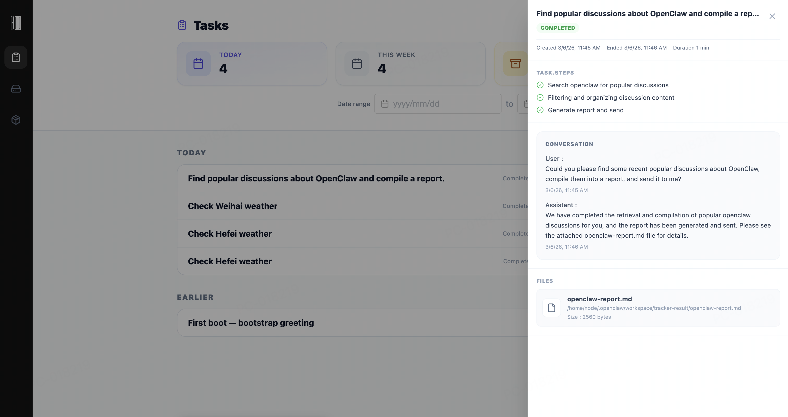
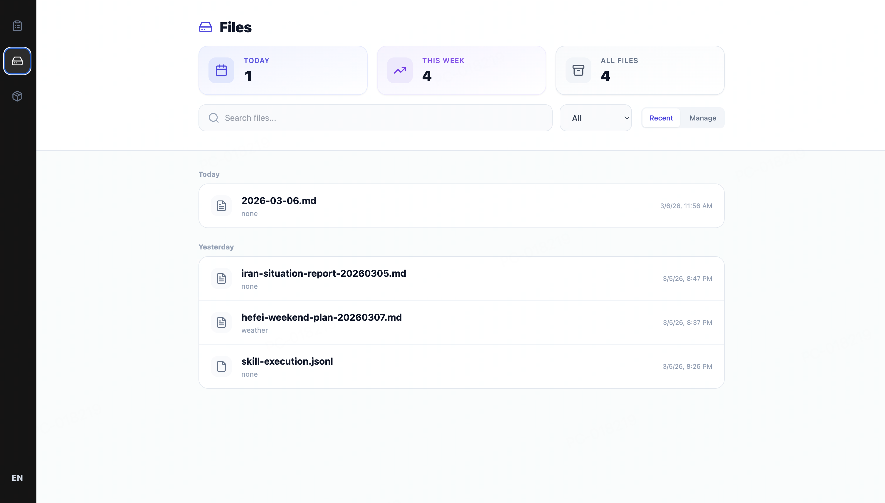
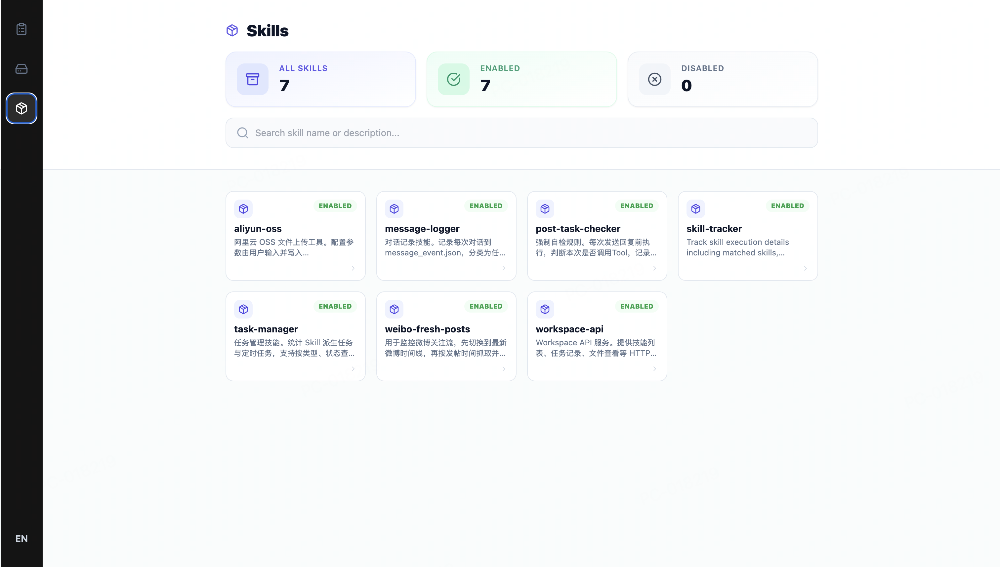

[English](README.md) | [中文](docs/README.zh-CN.md)

# OpenDeck — Assistant Management UI for OpenClaw

[](https://github.com/openclaw/open-deck)
[](https://github.com/openclaw/openclaw)
[](https://github.com/openclaw/open-deck)

**OpenDeck** is a lightweight AI workspace dashboard designed to visually manage OpenClaw tasks, files, and skills.
It helps users clearly observe the Agent execution process and manage AI-generated tasks and artifacts more efficiently.

[Documentation](docs/en/installation.md) · [Installation](docs/en/installation.md) · [Contributing](CONTRIBUTING.md)

## Why OpenDeck?
When running tasks with OpenClaw, users often encounter several practical challenges.

1. Too many tasks make human brain easy to lose context

  When multiple tasks are executed consecutively, or when a single task runs for a long time, users often forget:
  - What tasks they previously asked OpenClaw to execute
  - What the current task is supposed to do
  - Why OpenClaw is asking for additional information
  - By the time OpenClaw finishes a task or requests new input, the user may have already forgotten the original task context.


2. Too many generated files make them difficult to find and associate

Many AI workflows generate a large number of output artifacts, such as generated documents and uploaded reference materials.Although the file paths themselves may be clear, once the number of files increases, quickly locating and retrieving them becomes difficult

3. Users want to understand what steps a task actually executed and why it consumed so many tokens

OpenClaw does not present all the execution steps of a task within the conversation, making it hard for users to inspect the process and therefore difficult to optimize the task.

For these reasons, we built OpenDeck.
OpenDeck introduces a visual dashboard that consolidates tasks, generated files, and skills from OpenClaw into a unified interface.
Information that was previously scattered across logs and local directories becomes clear, structured, and easy to explore.

## Core Features
OpenDeck provides three core modules to help users better understand and manage the OpenClaw execution workflow.

### Tasks
The Tasks module visualizes OpenClaw’s task execution so users can clearly see what the Agent is currently doing.
In the task list, users can view:
- Current task list
- Task execution status
- Creation time
- Detailed task information
With the task dashboard, users can quickly understand the Agent’s workload and overall execution state.



### Files
The Files module centralizes all files generated during OpenClaw task execution.
As tasks increase, generated files tend to become scattered across multiple local directories, making them hard to track.
OpenDeck automatically collects these files and displays them in a unified interface.
Users can:
View the file list
Quickly preview files
Download generated files
OpenDeck also establishes task-to-file relationships, allowing users to quickly locate which files were produced by a specific task.



### Skills
The Skills module displays the skills used within OpenClaw, helping users understand the capabilities available to the Agent.
Users can view:
The list of available skills
Basic skill information
Skill usage details
Through this module, users can better understand the capability structure of their Agent and gradually accumulate reusable skills.



## Final Thoughts
By organizing tasks, files, and skills into a unified dashboard, OpenDeck turns OpenClaw from a black box into a transparent system.
It helps users:
Understand the Agent’s execution process more intuitively
Manage AI-generated results more efficiently


AI prefers CLI.
But humans — the bosses of AI — still prefer GUI. 
And bosses need a dashboard.


**Note:**
> OpenDeck can only display tasks created after installation and their associated files. Tasks executed and files generated before installation will not be shown.

## Quick Start

### prerequisites
- [OpenClaw](https://docs.openclaw.ai/) installed and configured
- Node.js ≥18, and pnpm or npm

### plan A

You can send the following prompt to your OpenClaw to automatically install and start OpenDeck.

<!-- 请按照这个 SKILL.md 帮我完成 open-deck 的部署：
https://github.com/netease-opendeck/opendeck/blob/main/SKILL.md
在安装完成之后，读取工作区 AGENTS.MD、skill-tracker/SKILL.MD、daily-reflection/SKILL.MD，并在后续所有agent的所有session中严格遵守执行。 -->

```markdown
Please follow this `SKILL.md` to help me deploy open-deck:
https://github.com/netease-opendeck/opendeck/blob/main/SKILL.md

After installation, read `AGENTS.MD`, `skill-tracker/SKILL.MD`, `daily-reflection/SKILL.MD` from the workspace, and strictly follow the execution in all sessions of all agents.

```

### plan B

```bash
git clone https://github.com/netease-opendeck/opendeck.git
cd opendeck

./scripts/install.sh -y
```

The install script will automatically install dependencies, build backend/frontend, and start the service (this may take a while).

In your OpenClaw chat, add this prompt once so the assistant loads and follows the tracker:

```markdown
After installation, read `AGENTS.MD`, `skill-tracker/SKILL.MD`, `daily-reflection/SKILL.MD` from the workspace, and strictly follow the execution in all sessions of all agents.
```


## Recommended language models

OpenDeck works with any model that your OpenClaw setup supports, but for better task tracking quality and response consistency we currently **recommend**:

- **Opus 4.6** (high reasoning capability, good for complex multi-step tasks)
- **GLM-5** (strong general-purpose model with good Chinese support)

## How it works

```
OpenClaw (workspace/skills, workspace/tracker-result/skill-execution.jsonl)
                    │
                    ▼
┌─────────────────────────────────────┐
│           OpenDeck Backend          │
│   (NestJS, serves frontend, 19520)  │
└─────────────────────────────────────┘
```

OpenDeck reads from your OpenClaw root: skills from `workspace/skills`, execution data from `workspace/tracker-result/skill-execution.jsonl`, and reflection markdown files from `workspace/memory/reflection`. No database—file-based.

## Configuration

Set the OpenClaw root in the backend (in the install directory, or when running from source):

- Copy `backend/.env.example` to `backend/.env`.
- Set `OPENCLAW_ROOT` to your OpenClaw project root (e.g. `~/.openclaw`).

Optional: `OPENCLAW_SKILLS_PATH`, `OPENCLAW_SKILL_EXECUTION_PATH`, `PORT`. See [backend README](backend/README.md).

## Uninstall

Use the uninstall script to remove OpenDeck runtime and installed skills:

```bash
./scripts/uninstall.sh
```

## Docs

- [Installation (EN)](docs/en/installation.md)
- [Usage (EN)](docs/en/usage.md)
- [安装说明（中文）](docs/zh/installation.md)
- [使用说明（中文）](docs/zh/usage.md)

## License

Apache-2.0. See [LICENSE](LICENSE).

## Community

See [CONTRIBUTING.md](CONTRIBUTING.md) for how to submit issues and pull requests.
